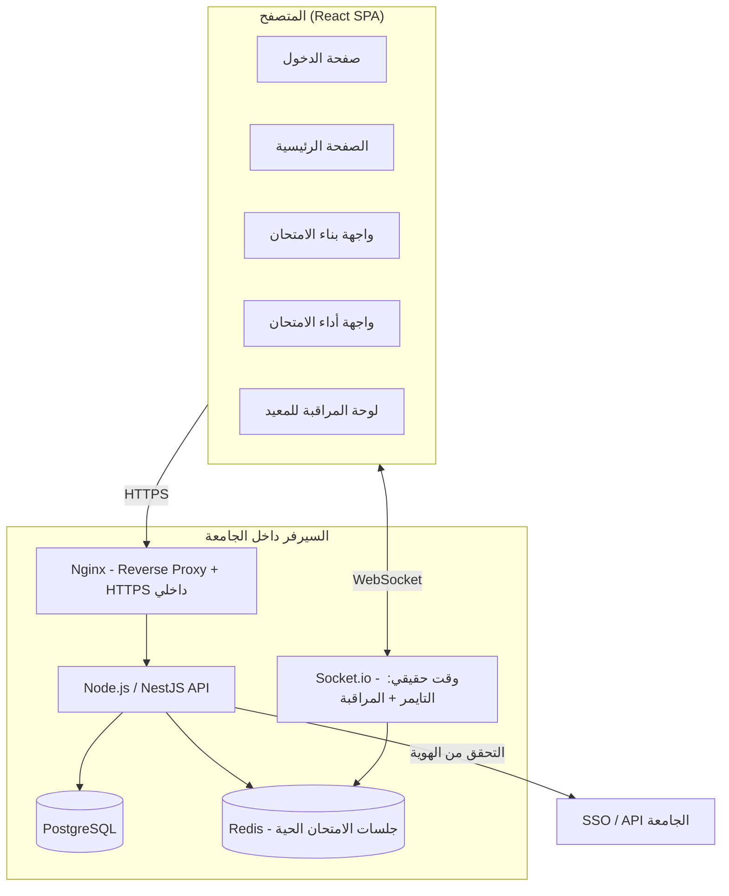

# تصميم منصة الامتحانات الجامعية — مشروع التخرج

## 1. ملخص القرارات المعتمدة

| المحور | القرار |
|---|---|
| نطاق الاستخدام | استخدام فعلي في الجامعة بعد المراجعة |
| مكان الامتحان | معمل الجامعة تحت إشراف مباشر |
| أنواع الأسئلة (v1) | اختيار من متعدد + صح/خطأ فقط |
| توزيع الصعوبة | خلطة ثابتة لكل امتحان (مثلاً: 6 سهل + 10 متوسط + 4 صعب) |
| توليد النسخ | نسخة فريدة لكل طالب من نفس الخلطة |
| الدرجات | لكل "فتحة صعوبة" وزن ثابت يحدده الدكتور، وليس لكل سؤال منفرد |
| حسابات المستخدمين | ربط مباشر بـ SSO/API الجامعة |
| الاستضافة | سيرفر داخل الجامعة (on-premise، بدون سحابة) |
| انقطاع الاتصال | استئناف تلقائي بالوقت المتبقي (محسوب من السيرفر) |
| الباك إند | Node.js + TypeScript |
| الواجهة | React |
| قاعدة البيانات | PostgreSQL (عبر Prisma ORM) |
| نشر امتحان المعيد | مباشر، بدون اعتماد من الدكتور |
| صلاحية الـ Admin | تعديل الامتحان فقط قبل بدايته — يتقفل تمامًا بعد ما يبدأ |
| رؤية النتيجة | الطالب لا يرى الدرجة ولا الإجابات إطلاقًا بعد التسليم |
| منع الغش | قفل fullscreen + منع نسخ/لصق (رادع ومُسجَّل، وليس ضمانًا مطلقًا) |
| الكويز | نفس آلية الامتحان (حقل `type` فقط) |

---

## 2. المعمارية العامة



**فكرة التصميم الأساسية:** كل شيء يعمل داخل شبكة الجامعة عبر Docker، بدون اعتماد على أي خدمة سحابية خارجية (تخزين، قاعدة بيانات، أو مصادقة).

### طبقة العزل عن أنظمة الجامعة (مهم جدًا)

بما أن الربط بـ SSO الجامعة لسه محتاج تأكيد فني من قسم تقنية المعلومات (البروتوكول بالظبط: SAML / OAuth2 / LDAP)، صمّم طبقة `AuthProvider` كـ interface منفصل تمامًا عن باقي الكود:

```typescript
interface AuthProvider {
  verifyCredentials(input: LoginInput): Promise<UniversityIdentity>;
}
```

ابدأ بتنفيذ `MockAuthProvider` للتطوير، وبعدها `UniversitySSOAuthProvider` الحقيقي لما يتأكد البروتوكول — بدون ما تلمس أي كود تاني في المشروع.

---

## 3. تصميم قاعدة البيانات (PostgreSQL)

### الجداول الأساسية

**users**
| الحقل | النوع | ملاحظات |
|---|---|---|
| id | UUID (PK) | |
| university_id | string, unique | الرقم الجامعي من SSO |
| full_name | string | |
| role | enum: ADMIN, DOCTOR, TA, STUDENT | |
| email | string | |
| created_at | timestamp | |

**courses**
| id | UUID (PK) |
| name | string |
| code | string |

**course_staff** (جدول ربط many-to-many)
| course_id | FK → courses |
| user_id | FK → users |
| role_in_course | enum: DOCTOR, TA |

**questions** (بنك الأسئلة)
| id | UUID (PK) |
| course_id | FK |
| text | text |
| type | enum: MCQ, TRUE_FALSE |
| options | jsonb |
| correct_answer | jsonb |
| difficulty | enum: EASY, MEDIUM, HARD |
| created_by | FK → users |
| times_used | int |
| correct_rate | float, nullable — يُحدَّث تلقائيًا بعد كل امتحان لمساعدة الدكتور |

**exams** (الامتحان أو الكويز — نفس الجدول)
| id | UUID (PK) |
| course_id | FK |
| created_by | FK → users |
| type | enum: EXAM, QUIZ |
| title | string |
| duration_minutes | int |
| status | enum: DRAFT, PUBLISHED, IN_PROGRESS, CLOSED |
| scheduled_start | timestamp |
| scheduled_end | timestamp |

**exam_slots** (تعريف الخلطة — هنا تعيش الدرجة، وليس في السؤال)
| id | UUID (PK) |
| exam_id | FK |
| difficulty | enum: EASY, MEDIUM, HARD |
| question_count | int |
| points_per_question | int — يحدده الدكتور يدويًا |

**exam_attempts** (محاولة كل طالب)
| id | UUID (PK) |
| exam_id | FK |
| student_id | FK |
| status | enum: NOT_STARTED, IN_PROGRESS, SUBMITTED |
| started_at | timestamp |
| submitted_at | timestamp, nullable |
| final_score | int, nullable |
| ip_address | string |

**attempt_questions** (النسخة المولَّدة لكل طالب — Snapshot ثابت)
| id | UUID (PK) |
| attempt_id | FK |
| slot_id | FK → exam_slots |
| question_snapshot | jsonb — نص السؤال والاختيارات **وقت التوليد**، مش رابط حي للسؤال |
| order_index | int |
| student_answer | jsonb, nullable |
| is_correct | boolean, nullable |
| points_awarded | int, nullable |

**violation_logs**
| id | UUID (PK) |
| attempt_id | FK |
| type | enum: TAB_SWITCH, COPY_PASTE, FULLSCREEN_EXIT |
| occurred_at | timestamp |

**audit_log** (لأي تعديل إداري — مطلوب لأن المنصة هتُستخدم فعليًا)
| id | UUID (PK) |
| actor_id | FK → users |
| action | string |
| entity_type / entity_id | string / UUID |
| diff | jsonb — القيمة قبل وبعد |
| occurred_at | timestamp |

### نقطة تصميم حرجة: لماذا `question_snapshot` وليس مجرد `question_id`؟

لو الدكتور عدّل سؤال في البنك بعد الامتحان، وورقة الطالب بترجع لنفس السؤال بالـ id، هتتغير الورقة بأثر رجعي. تخزين نسخة كاملة (snapshot) من نص السؤال والاختيارات وقت التوليد يحمي من كده، ويسمح بالتظلّم لاحقًا برؤية الورقة **بالظبط** زي ما شافها الطالب.

---

## 4. تصميم الـ API (REST + WebSocket)

### المصادقة
```
POST   /api/auth/login              → عبر AuthProvider (SSO)
POST   /api/auth/logout
GET    /api/auth/me
```

### إدارة المقررات والفريق
```
GET    /api/courses
POST   /api/courses                          [ADMIN]
POST   /api/courses/:id/staff                [ADMIN]  إضافة دكتور/معيد
```

### بنك الأسئلة
```
GET    /api/courses/:id/questions?difficulty=&type=
POST   /api/courses/:id/questions             [DOCTOR, TA]
PATCH  /api/questions/:id                     [DOCTOR, TA - creator only]
DELETE /api/questions/:id
GET    /api/questions/:id/stats                نسبة الإجابة الصحيحة التاريخية
```

### بناء الامتحان
```
POST   /api/exams                             [DOCTOR, TA]
PATCH  /api/exams/:id                         [قبل status=PUBLISHED فقط]
POST   /api/exams/:id/slots                   تعريف الخلطة (صعوبة × عدد × درجة)
POST   /api/exams/:id/publish
GET    /api/exams/:id/bank-check               ← تحقق: هل البنك كافٍ؟ (قبل النشر)
```

### أداء الامتحان (الطالب)
```
POST   /api/exams/:id/attempts/start
        → يولّد النسخة (attempt_questions) من البنك حسب الـ slots
        → يسجل started_at من السيرفر
        → إذا كانت هناك محاولة IN_PROGRESS بالفعل، يرجّعها كما هي (استئناف)

GET    /api/attempts/:id                       جلب النسخة الحالية + الوقت المتبقي (محسوب سيرفريًا)
PATCH  /api/attempts/:id/answers/:questionId    autosave لكل إجابة فور اختيارها
POST   /api/attempts/:id/submit                 تسليم نهائي → قفل + تصحيح تلقائي
POST   /api/attempts/:id/violations              تسجيل حدث غش (tab switch, copy/paste)
```

### المراقبة (لوحة المعيد الحية)
```
GET    /api/exams/:id/monitor                   حالة كل طالب لحظيًا (WebSocket)
```

### الإدارة
```
PATCH  /api/exams/:id/admin-override            [ADMIN - قبل البدء فقط]
GET    /api/audit-log?entity=
GET    /api/exams/:id/results                    [DOCTOR/ADMIN فقط — الطالب لا يصل هنا أبدًا]
```

**قاعدة صلاحيات عامة تُطبَّق على كل الـ endpoints:** middleware واحد للـ RBAC يتحقق من `role` + ملكية المورد (مثلاً: المعيد يعدّل بس أسئلته هو)، وده أنضف من تكرار الشرط في كل route.

---

## 5. الأدوات المطلوبة (Tooling)

| الطبقة | الأداة | السبب |
|---|---|---|
| Backend framework | **NestJS** (فوق Node/TS) | بنية modules/controllers منظمة تناسب الأدوار المختلفة (Auth, Exams, Questions...) وسهلة الشرح في المناقشة |
| ORM | **Prisma** | type-safety مع TS + migrations واضحة |
| Database | **PostgreSQL** | علاقات صارمة + transactions لضمان تسليم الامتحان بدون تعارض |
| Cache / Live state | **Redis** | حالة الجلسات الحية والتايمر، خصوصًا مع دخول 20-30 طالب في نفس اللحظة |
| Real-time | **Socket.io** | التايمر ولوحة مراقبة المعيد |
| Frontend | **React + Vite + TypeScript** | |
| التنسيق | **Tailwind CSS** | سهل تعريف نظام ألوان مخصص (برتقالي/رصاصي فاتح/أبيض) كـ design tokens بدل الألوان الافتراضية |
| Validation | **Zod** | نفس الـ schema للتحقق في الفرونت والباك |
| الحاويات | **Docker + Docker Compose** | كل الخدمات (API, DB, Redis, Nginx) في سيرفر الجامعة كوحدة واحدة |
| Reverse Proxy | **Nginx** | HTTPS داخلي + تقييد الوصول على نطاق IP المعمل |
| التحكم بالإصدارات | **Git + GitHub** | |

---

## 6. خطة التنفيذ المقترحة (Roadmap)

1. **التأكيد الفني مع تقنية المعلومات بالجامعة**: بروتوكول الـ SSO بالظبط، ومواصفات السيرفر المتاح.
2. **هيكلة المشروع**: إعداد NestJS + Prisma + PostgreSQL + Docker Compose، وتنفيذ `MockAuthProvider` للتطوير.
3. **وحدة المستخدمين والمقررات**: users, courses, course_staff + RBAC middleware.
4. **بنك الأسئلة**: CRUD كامل + تصنيف الصعوبة.
5. **بناء الامتحان**: exams + exam_slots + endpoint التحقق من كفاية البنك قبل النشر.
6. **محرك التوليد والأداء**: توليد النسخة الفريدة، الـ snapshot، autosave، التايمر السيرفري، الاستئناف بعد الانقطاع.
7. **التصحيح التلقائي + audit_log**.
8. **لوحة المراقبة الحية** (WebSocket) + تسجيل مخالفات الغش.
9. **الواجهة الأمامية**: تسجيل الدخول → الصفحة الرئيسية → بناء الامتحان → أداء الامتحان، بنظام الألوان المتفق عليه.
10. **التقييد الأمني**: حصر الدخول على IP المعمل، HTTPS داخلي، rate limiting.
11. **اختبار الحمل**: محاكاة 20-30 طالب يبدأون في نفس الثانية (أخطر سيناريو في المشروع).
12. **التوثيق والنشر على سيرفر الجامعة** + كتابة توثيق المناقشة (التصميم، الـ ERD، قرارات الأمان).

---

## 7. ملاحظة على حدود الأمان

قفل fullscreen ومنع النسخ/اللصق أدوات رادعة تُسجَّل في `violation_logs`، لكنها ليست ضمانًا تقنيًا مطلقًا — أي حماية تعتمد على جافاسكريبت في المتصفح يمكن تجاوزها من طالب لديه خبرة تقنية. خط الدفاع الحقيقي هو الإشراف البشري في المعمل، والنظام التقني دوره تسجيل الأدلة له وقت اتخاذ القرار، وليس منع الغش بمفرده.
